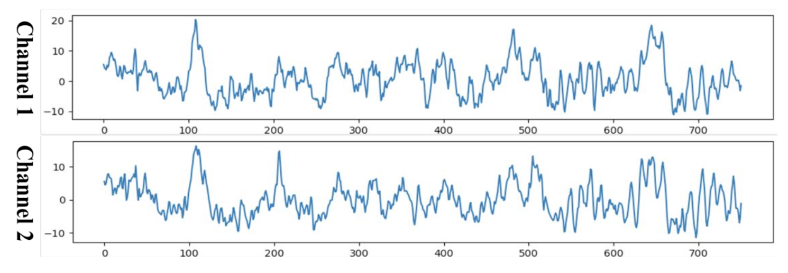
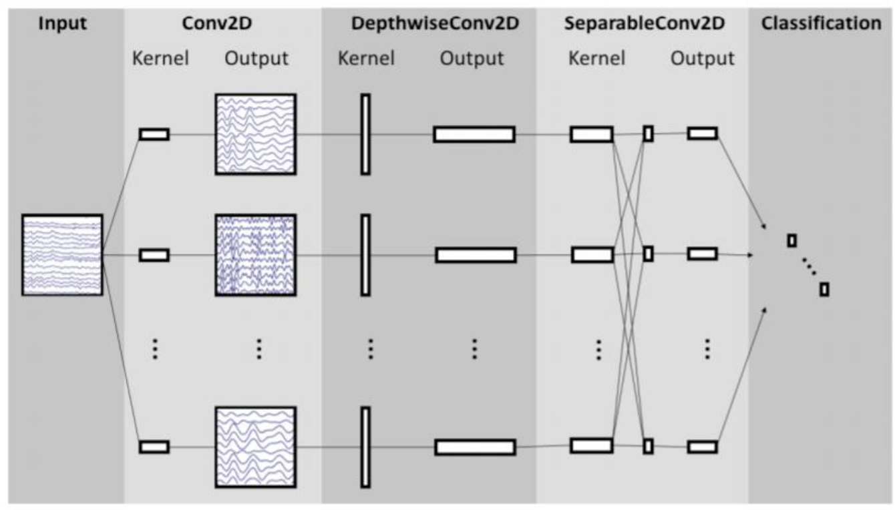
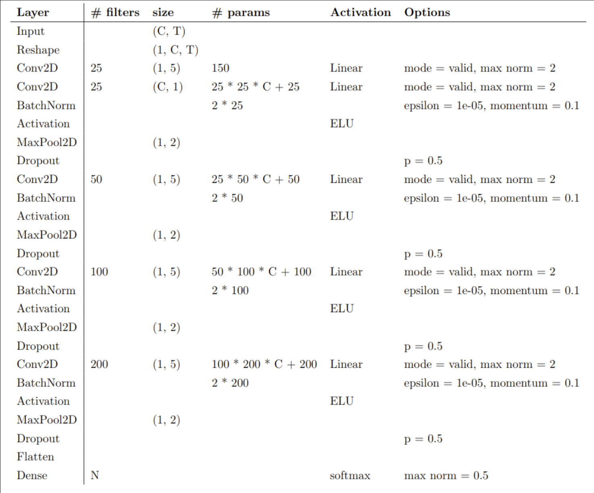
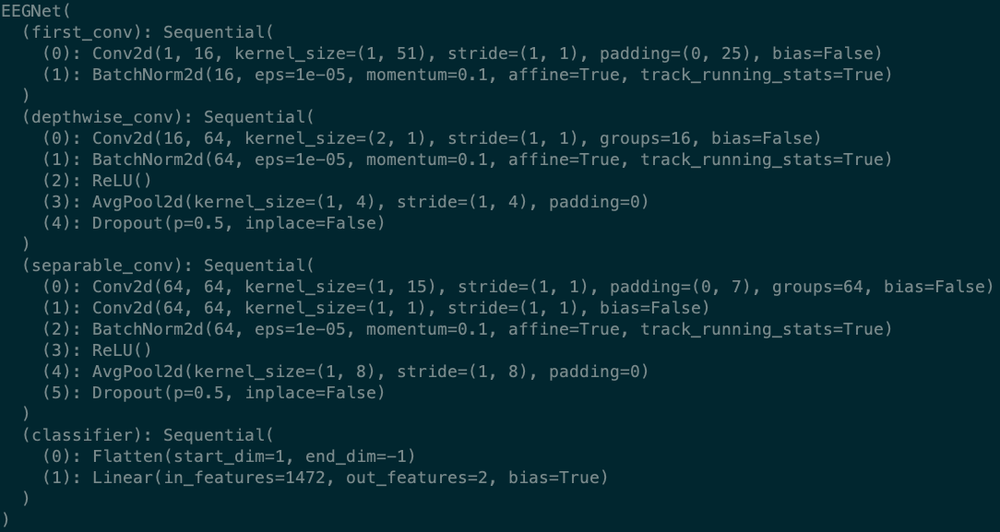
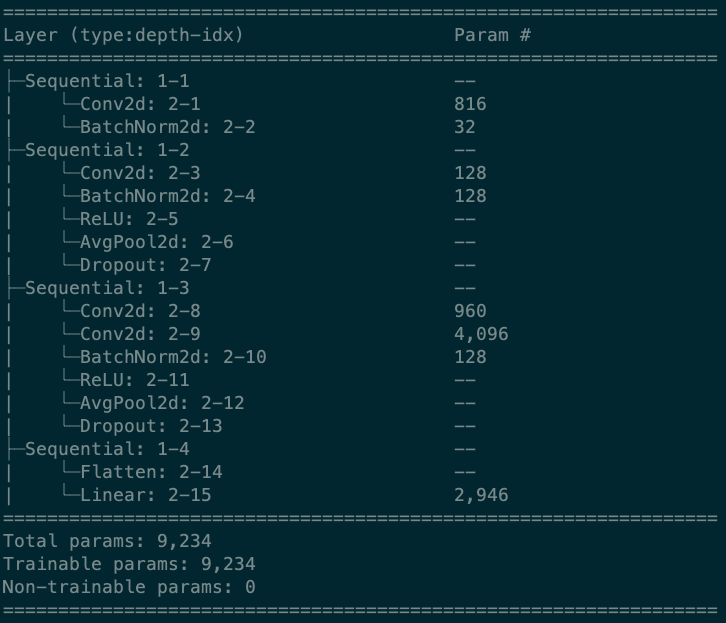
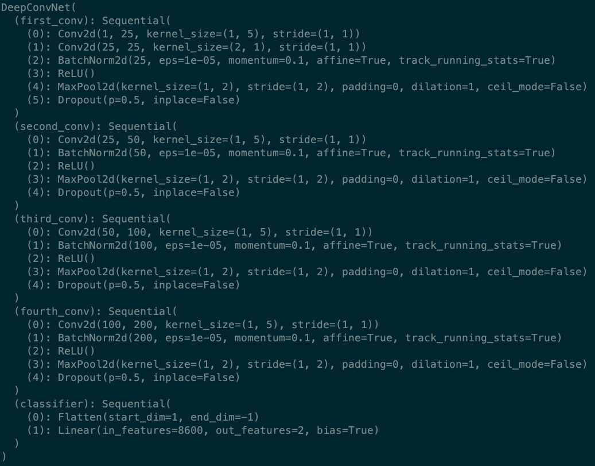
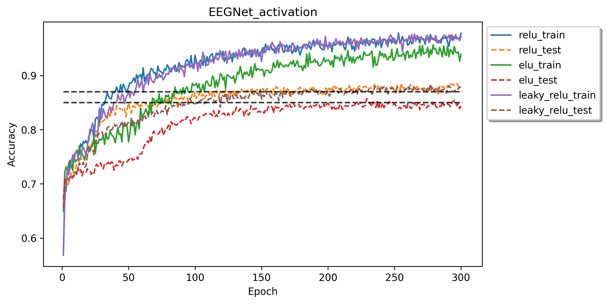
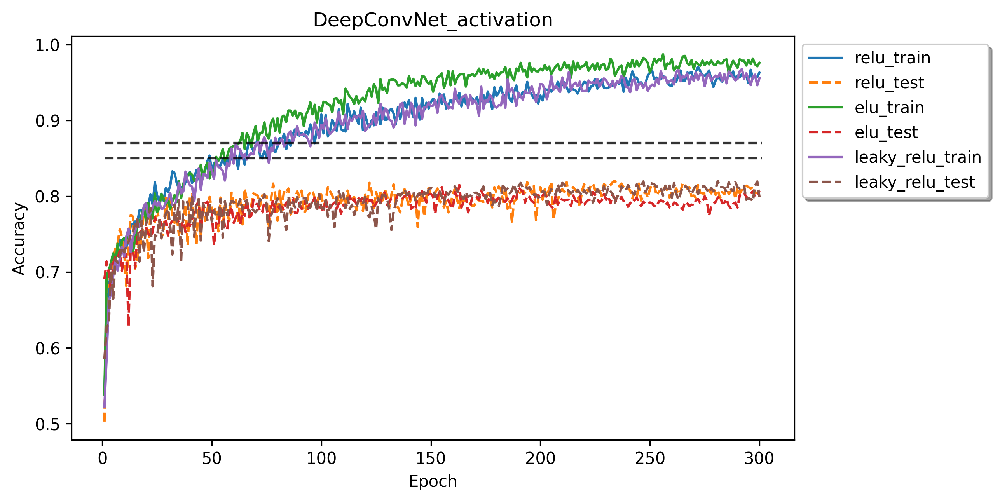
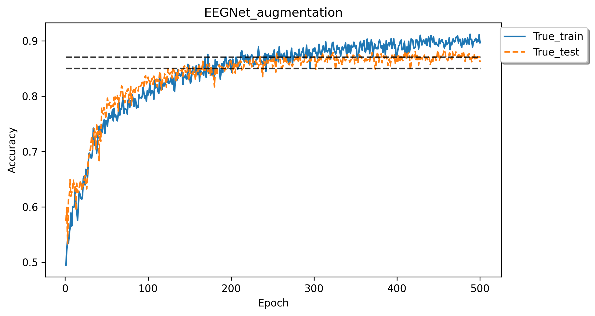

# Lab 2: EEG Classification

```
name	  : 周俊川
student id: 310551002
```

## Table of contents

- [Lab 2: EEG Classification](#lab-2-eeg-classification)
	- [Table of contents](#table-of-contents)
	- [Introduction](#introduction)
	- [Experiment set up](#experiment-set-up)
			- [The detail of model: EEGNet](#the-detail-of-model-eegnet)
			- [The detail of model: DeepConvNet](#the-detail-of-model-deepconvnet)
			- [Activation function](#activation-function)
	- [Experimental results](#experimental-results)
			- [The highest testing accuracy](#the-highest-testing-accuracy)
			- [Comparison figures](#comparison-figures)
	- [Discussion](#discussion)
			- [Implementation of separable convolution](#implementation-of-separable-convolution)
			- [Data augmentation experiments](#data-augmentation-experiments)
	- [References](#references)

## Introduction

In this lab, I'm going to implement and train simple EEG classification models which are **EEGNet and DeepConvNet** [1], with BCI competition preprocessed dataset, which is 2 classes with 2 channels, 750 times data points. A sample is shown below.



Additionally, I also compare the results by three different kinds of activation function including **ReLU**, **Leaky ReLU**, **ELU**.

In last section, I will share some implementation detail of separable convolution, and some result of data augmentation experiment.

## Experiment set up

The implementation module is implemented in **eegclassify**, including
- `model.py`: implementation of **EEGNet** and **DeepConvNet**.
- `dataset.py`: implementation of `Dataset` for pytorch functionalities.
- `trainer.py`: implementation of training and evaluation logic.
- `preprocess.py`: additional implementation of various signal preprocessing method for augmentation usage [2].

I setup a config for hyperparameter experiment in `config` folder, and use `main.py` to execute the experiment for getting the result. The `eval.py` is only use for evaluation by setup a config in `eval_config` folder. 

#### The detail of model: EEGNet

Overall visualization of the EEGNet architecture and implementation is shown below

```python
class EEGNet(ExtendedModule):
    def __init__(
        self,
        dropout_prob: float = 0.5,
        temporal_filter_size_1: int = 16,
        temporal_filter_size_2: int = 32,
        spatial_filter_depth: int = 2,
        activation: str = 'elu'
    ):
        """
        EEGNet

        Args:
            dropout_prob (float, optional): dropout probabilty. Defaults to 0.5.
            temporal_filter_size_1 (int, optional): temporal filter size in depthwise convolution. Defaults to 16.
            temporal_filter_size_2 (int, optional): temporal filter size in separable convolution. Defaults to 32.
            spatial_filter_depth (int, optional): depth of spatial filter. Defaults to 2.
            activation (str, optional): activation function use in hidden layer. Defaults to 'elu'.
        """
        super(EEGNet, self).__init__()
        self.first_conv = nn.Sequential(
            nn.Conv2d(1, temporal_filter_size_1, kernel_size=(1, 51), stride=(1, 1), padding=(0, 25), bias=False),
            nn.BatchNorm2d(temporal_filter_size_1, eps=1e-05, momentum=0.1, affine=True, track_running_stats=True)
        )
        self.depthwise_conv = nn.Sequential(
            nn.Conv2d(
                temporal_filter_size_1, spatial_filter_depth * temporal_filter_size_1, kernel_size=(2, 1),
                stride=(1, 1),
                groups=temporal_filter_size_1, bias=False
            ),
            nn.BatchNorm2d(
                spatial_filter_depth * temporal_filter_size_1, eps=1e-05, momentum=0.1, affine=True,
                track_running_stats=True
            ),
            get_activation(activation),
            nn.AvgPool2d(
                kernel_size=(1, 4),
                stride=(1, 4),
                padding=0
            ),
            nn.Dropout(p=dropout_prob)
        )
        self.separable_conv = nn.Sequential(
            nn.Conv2d(
                spatial_filter_depth * temporal_filter_size_1, spatial_filter_depth * temporal_filter_size_1,
                kernel_size=(1, 15),
                stride=(1, 1),
                padding=(0, 7),
                groups=spatial_filter_depth * temporal_filter_size_1, bias=False
            ),
            nn.Conv2d(
                spatial_filter_depth * temporal_filter_size_1, temporal_filter_size_2, kernel_size=(1, 1),
                stride=(1, 1),
                bias=False
            ),
            nn.BatchNorm2d(temporal_filter_size_2, eps=1e-05, momentum=0.1, affine=True, track_running_stats=True),
            get_activation(activation),
            nn.AvgPool2d(
                kernel_size=(1, 8),
                stride=(1, 8),
                padding=0
            ),
            nn.Dropout(p=dropout_prob),
        )
        self.classifier = nn.Sequential(
            nn.Flatten(),
            nn.Linear(temporal_filter_size_2 * 23, 2, bias=True)
        )

    def forward(self, x: tensor) -> tensor:
        """
        Forward pass of the model.

        Args:
            x (tensor): input data

        Returns:
            tensor: output data
        """
        x = self.first_conv(x)
        x = self.depthwise_conv(x)
        x = self.separable_conv(x)
        x = self.classifier(x)
        return x
```


#### The detail of model: DeepConvNet

Overall visualization of the DeepConvNet architecture and implementation is shown below. Max norm is ignorable is this lab.

```python
class DeepConvNet(ExtendedModule):
    def __init__(
        self,
        channel_list: list = [25, 50, 100, 200],
        dropout_prob: float = 0.5,
        activation: str = 'elu'
    ):
        """
        DeepConvNet

        Args:
            channel_list (list, optional): channel list. Defaults to [25, 50, 100, 200].
            dropout_prob (float, optional): dropout probability. Defaults to 0.5.
            activation (str, optional): activation function use in hidden layer. Defaults to 'elu'.
        """
        super(DeepConvNet, self).__init__()
        self.first_conv = nn.Sequential(
            nn.Conv2d(1, channel_list[0], kernel_size=(1, 5)),
            nn.Conv2d(channel_list[0], channel_list[0], kernel_size=(2, 1)),
            nn.BatchNorm2d(channel_list[0], eps=1e-05, momentum=0.1, affine=True, track_running_stats=True),
            get_activation(activation),
            nn.MaxPool2d(kernel_size=(1, 2)),
            nn.Dropout(p=dropout_prob)
        )
        self.second_conv = self._conv_block(channel_list[0], channel_list[1], dropout_prob, activation)
        self.third_conv = self._conv_block(channel_list[1], channel_list[2], dropout_prob, activation)
        self.fourth_conv = self._conv_block(channel_list[2], channel_list[3], dropout_prob, activation)
        self.classifier = nn.Sequential(
            nn.Flatten(),
            nn.Linear(8600, 2, bias=True)
        )

    def _conv_block(
            self, in_channels: int, out_channels: int, dropout_prob: float = 0.5, activation: str = 'elu'
    ) -> nn.Sequential:
        """
        Convolutional block.

        Args:
            in_channels (int): input channels.
            out_channels (int): output channels.
            dropout_prob (float, optional): dropout probability. Defaults to 0.5.
            activation (str, optional): activation function in hidden layer. Defaults to 'elu'.

        Returns:
            nn.Sequential: convolutional block.
        """
        return nn.Sequential(
            nn.Conv2d(in_channels, out_channels, kernel_size=(1, 5)),
            nn.BatchNorm2d(out_channels, eps=1e-05, momentum=0.1, affine=True, track_running_stats=True),
            get_activation(activation),
            nn.MaxPool2d(kernel_size=(1, 2)),
            nn.Dropout(p=dropout_prob)
        )

    def forward(self, x: tensor) -> tensor:
        """
        Forward pass of the model.

        Args:
            x (tensor): input data

        Returns:
            tensor: output data
        """
        x = self.first_conv(x)
        x = self.second_conv(x)
        x = self.third_conv(x)
        x = self.fourth_conv(x)
        x = self.classifier(x)
        return x
```

#### Activation function

Table below shows some characteristic difference between **ReLU**, **Leaky ReLU** and **ELU**.

|             | ReLU                                                  | Leaky ReLU                                               | ELU                               |
| :---------- | :---------------------------------------------------- | :------------------------------------------------------- | :-------------------------------- |
| Function    | max(0, z)                                             | max(alpha * z, z)                                        | z if z >= 0 else alpha * (e^z -1) |
| Derivatives | 1 if z > 0 else 0                                     | 1 if z > 0 else alpha                                    | 1 if z > 0 else alpha * e^z       |
| Pros        | avoid gradient vanishing problem                      | fix dying ReLU problem                                   | strong alternatives               |
| Cons        | result in dead neuron when x < 0 (dying ReLU problem) | it possess linearity, so it can't use in complex problem | slower computation                |


## Experimental results

I setup the final hyperparameters combination as below

- Parameters
  - batch size: 64
  - epochs: 300
  - learning rate: 0.001
  - optimizer: adam
  - weight decay: 0.0001
  - dropout rate: 0.5

| Model       | Architecture                       | Parameters                            |
| :---------- | :--------------------------------- | :------------------------------------ |
| EEGNet      |       |       |
| DeepConvNet |  |  |

#### The highest testing accuracy

The results show that **EEGNet** achieve the highest accuracy in each activation functions compare to **DeepConvNet**. In addition, train with **ReLU** and **Leaky ReLU** can get the accuracy higher than **87%**.

| Model       |       ReLU | Leaky ReLU |    ELU |
| :---------- | ---------: | ---------: | -----: |
| EEGNet      | **87.50%** | **87.87%** | 84.35% |
| DeepConvNet |     80.46% |     79.91% | 80.74% |

#### Comparison figures

Although either **EEGNet** or **DeepConvNet** are resulting in overfitting, **DeepConvNet** has larger gap between training accuracy and testing accuracy as training longer and it is more severe in overfitting due to its larger weight parameters. **EEGnet** has smaller parameters size, train faster and get the better results.

- EEGNet


- DeepConvNet


## Discussion

#### Implementation of separable convolution

Arcording to [1] and [3], separable convolution is the combination of depthwise convolution and pointwise convolution, which is 1x1 kernel size convolution. This method could reduce large number of parameters while preserving the similar receptive field and performance.
- classical convolution parameter size: $$kernel\_size * kernel\_size * input\_channel * output\_channel$$
- separable convolution parameter size: $$kernel\_size * kernel\_size * input\_channel + input\_channel * output\_channel$$

**EEGNet** is using separable convolution in second block of convolution. Hence, instead of the architecture provided by TAs, the actual implementation and architecture of separable convolution for the **EEGNet** should be 
- First, add a depthwise convolution layer by setting groups as same as input filter size;
- Second, add a 1x1 convolution (pointwise convolution) layer

The actual code illustration is as below
```python
...
self.separable_conv = nn.Sequential(
    nn.Conv2d(
	spatial_filter_depth * temporal_filter_size_1, spatial_filter_depth * temporal_filter_size_1,
	kernel_size=(1, 15),
	stride=(1, 1),
	padding=(0, 7),
	groups=spatial_filter_depth * temporal_filter_size_1, bias=False
    ),
    nn.Conv2d(
	spatial_filter_depth * temporal_filter_size_1, temporal_filter_size_2, kernel_size=(1, 1),
	stride=(1, 1),
	bias=False
    )
...
```

#### Data augmentation experiments

Due to the performance gap between training and testing as training longer, I try to add some data augmentation for training data, which reference from [2], while should preserve the local characteristics of signal sequences. The data augmentation I added in `preprocess.py` include
- `jitter`: add random noise.
- `scaling`: add small multiplier
- `random flip`: randomly flip signal sequence by multiply -1
- `random shift`: randomly shift (roll) signal sequence
- `random window slice`: slice a window of sequence (similar to random crop for images)

The result shows that the accuracy gap between training data and testing data is smaller after add data augmentation. It has the ability to train to get higher accuracy with hyperparameter tunning and longer epochs.



## References
[1] https://arxiv.org/pdf/1611.08024.pdf
[2] https://arxiv.org/pdf/1706.00527.pdf
[3] https://leimao.github.io/blog/Depthwise-Separable-Convolution/